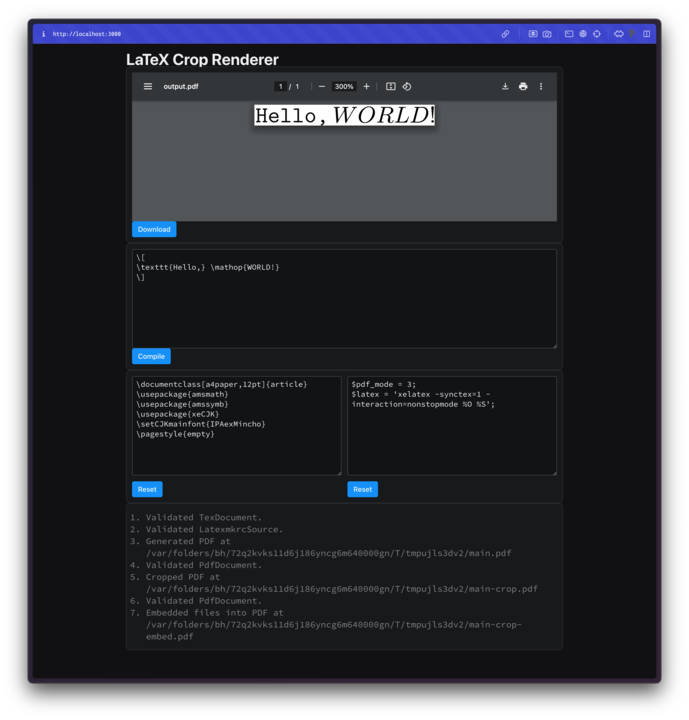

# LaTeX Crop



This is a simple app that
1. Compiles a LaTeX document
2. Crops the resulting PDF
3. Embeds the LaTeX source code in the cropped PDF

**Please use this app at your own risk, for this is just a demo version.**

## How to Run

Set up the LaTeX environment. TeX Live or MacTeX is recommended.

Install [mise](https://github.com/mise-app/mise) (recommended).

Run the following command to install python package management tool `uv`.

```bash
mise trust
mise i
```

Move to the directory `src/presentation/`. Run the app with `reflex` command.

```bash
cd src/presentation/
uv run reflex run
```
